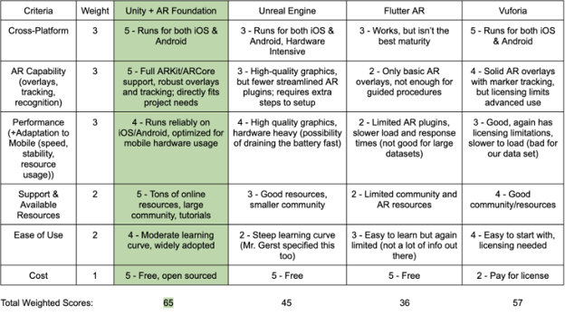
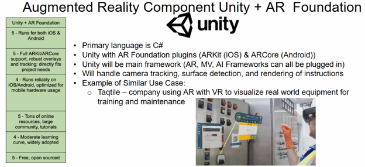
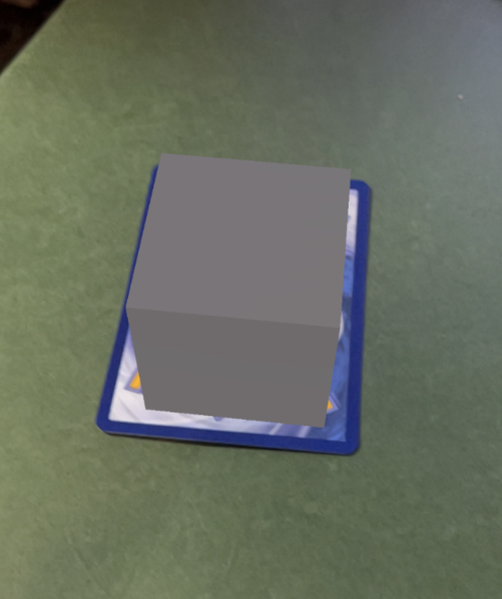

# Honeywell AR & Machine Vision App for Electric and Gas Meters

**Case study — code not publicly available due to agreement with Honeywell**

# Overview
As part of a 5-person senior design team, I helped build an iOS application with augmented reality and machine vision capabilities for Honeywell. The app detects electric and gas meters in real time and displays an AR UI overlay containing documentation, data sheets, and meter information — directly in the technician's field of view.

# Purpose
Field service technicians servicing Honeywell meters often rely on manual lookup like cross-referencing model numbers, pulling documentation, and identifying meter types by hand. This is slow and error-prone, especially outdoors or in industrial environments. This app improves their efficiency with just pointing the iPad at a meter, and then relevant data appears instantly.

# Impact
Reduces meter identification and service time, cuts documentation-lookup errors, and improves technician onboarding by not needing to memorize model-specific details. The app was well received by Honeywell engineers and is being considered for real-world implementation.

# Team Approach
Work was divided into five functional areas:
- AR and Overlay UI Creation
- Machine Vision
- AI Helper
- Integration (combining all components)
- Testing

# AR Decision Matrix

#### **Unity Information:**

# Tech Stack
| Tool | Purpose |
|---|---|
| Unity (ARKit + ARCore) | Core component tying all systems together; handles AR capabilities and UI overlay creation |
| Xcode | Builds the Unity project into a deployable iOS application |
| YOLOv8 | Machine vision model that detects whether an object is a Honeywell meter, and classifies it as electric or gas |
| Botpress | AI helper that answers technician questions using provided meter documentation |

# My Role & Contributions
- Led the decision matrix used to select the software stack
- Built the augmented reality features and real-time UI overlay
- Implemented meter object tracking
- Handled Apple/iPad integration — building the app for the device
- Managed the Unity-to-Xcode pipeline for test runs on hardware

# Demo
#### First iteration of Object Tracking using Pokemon card and a cube prefab:

  

[1st Object Tracking Test with Pokemon card](https://youtube.com/shorts/WiphalBvLNg)

